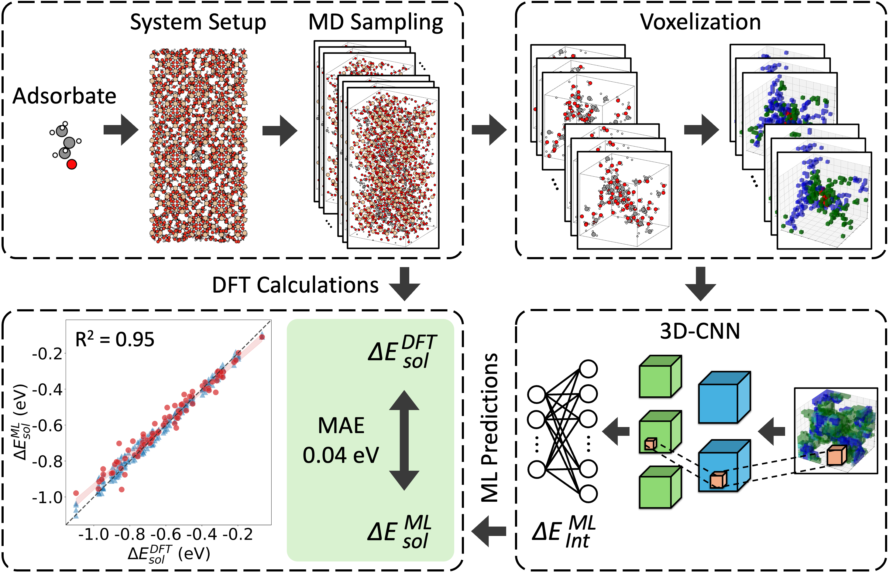

# 3D-CNN Zeolite Solvation

This repository accompanies the manuscript:

**Predicting Solvation Thermodynamics of Adsorbates in Zeolite Pores Using Convolutional Neural Networks with Attention Mechanisms**

The repository contains energy tables, data-processing and modeling scripts,
trained model checkpoints, representative molecular-simulation files, and the
analysis outputs used to support the manuscript.



**Figure: Overall workflow for predicting adsorbate-solvent interaction energies in Ti-FAU zeolite pores.** Molecular dynamics (MD) snapshots are converted into voxel-grid representations of local adsorbate-solvent configurations, which are then used to train attention-enhanced three-dimensional convolutional neural networks to predict DFT-derived interaction energies.

## Repository Contents

```text
3dcnn-zeolite-solvation/
├── python_scripts/          # Data processing, voxelization, training, evaluation, and plotting scripts
├── database/                # Clean DFT interaction-energy tables
├── dataset_cnn/             # Voxel-dataset configuration and regeneration instructions
├── output_model_cnn/        # Trained model checkpoints and training records
├── output_figures/          # Figures and visualization outputs generated from the analysis
├── md_simulations/          # Representative LAMMPS and CP2K simulation files
├── overall_workflow.png     # Workflow overview figure
├── environment.yml          # Conda environment for local data processing and analysis
├── LICENSE
└── README.md
```

The `md_simulations/` directory documents the molecular-simulation setup with
representative LAMMPS and CP2K files. The `database/` directory contains the
energy labels used for model training. Generated voxel pickle files are not
versioned because each file exceeds GitHub's 100 MB limit; the corresponding
configuration and regeneration command are provided in `dataset_cnn/`.
See [`python_scripts/README.md`](python_scripts/README.md) for script roles and
[`dataset_cnn/`](dataset_cnn/) for the example voxel configuration.

## Installation

The required Python packages and tested versions are provided in `environment.yml`. From the repository root, create and activate the Conda environment with:

```bash
conda env create -f environment.yml
conda activate zeolite-3dcnn
```

Verify the PyTorch installation and available compute devices with:

```bash
python python_scripts/test_pytorch.py --skip-benchmark
```

This environment reproduces the CPU-compatible setup used for local data processing, voxel generation, plotting, and model evaluation. Model training on a GPU cluster requires a CUDA-enabled PyTorch build compatible with the cluster CUDA version; refer to the [official PyTorch installation selector](https://pytorch.org/get-started/locally/) for the appropriate installation command.

## Basic Usage

Run commands from the repository root.

Generate the representative serialized voxel dataset:

```bash
python python_scripts/store_grids_pickle.py \
  --test \
  --zeolite FAU \
  --environment methanol_240_water_960-hydrophilic \
  --adsorbate 02_01_02_propanol
```

Train the 3D-CNN model:

```bash
python python_scripts/train_3d_cnn.py
```

Full cross-validation training requires the complete locally generated voxel
dataset; the representative example is intended to verify preprocessing and
data loading.

Generate the model-performance, training-history, attention, and spatial
attribution figures:

```bash
python python_scripts/plot_3d_cnn_results.py
python python_scripts/plot_training_info.py
python python_scripts/plot_attention_results.py
python python_scripts/plot_importance_spatial.py
```

Sample- and model-specific settings for the analysis scripts are defined in
their main blocks. Repository paths are resolved by `python_scripts/core/path.py`
and can be overridden with the `ZEOLITE_SOLVATION_PATH` environment variable.

## Reproducing the Manuscript Workflow

The main workflow is:

1. Prepare energy-label tables in `database/`.
2. Extract molecular descriptors and hydrogen-bond information from the MD
   configurations, then generate and augment the voxel representations.
3. Serialize the voxel grids to `dataset_cnn/` with
   `store_grids_pickle.py`.
4. Train and evaluate the 3D-CNN models using scripts in `python_scripts/`.
5. Save trained checkpoints to `output_model_cnn/` and generate manuscript
   and Supporting Information figures in `output_figures/`.

The repository includes clean energy tables, trained fold checkpoints, and
representative LAMMPS and CP2K files. Large generated voxel datasets and full
trajectory collections must be regenerated locally or distributed through an
external data archive.

## Citation

If you use this repository, please cite the accompanying manuscript:

```bibtex
@article{shi_zeolite_3dcnn,
  title = {Predicting Solvation Thermodynamics of Adsorbates in Zeolite Pores Using Convolutional Neural Networks with Attention Mechanisms},
  author = {Shi, Jiexin and Chen, Xiuting and Getman, Rachel B.},
  journal = {Journal of Chemical Information and Modeling},
  note = {Manuscript submitted}
}
```

## License

This project is distributed under the MIT License. See `LICENSE` for details.

## Contact

Rachel B. Getman  
William G. Lowrie Department of Chemical and Biomolecular Engineering  
The Ohio State University  
getman.11@osu.edu
